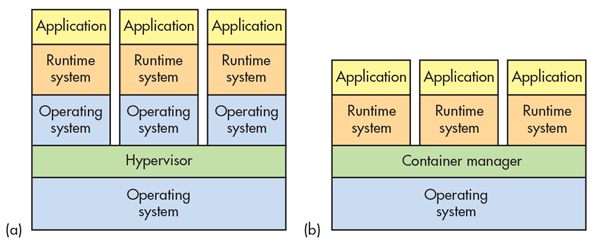

Link to presentation

https://docs.google.com/presentation/d/1kJp-376TJOHebUMMM5nGSkxT1kM_6UZeI0hnTGNK6-g/edit?usp=sharing

# Containers

## Introduction

### What is a container?

For the uneducated, a container can be thought of as an Virtual Machine. Except its **NOT!**

The main difference between an virtual machine and a container is the **Operating system**. A virtual machine is a machine within a machine, which means it has all the dependencies of a real machine. 

Example, to run a **NodeJS** server on a virtual machine requires:
1. Bootloader
1. Operating system
1. NodeJS runtime
1. Application code

A container, however, shares the underlying host OS and the abstraction layer starts above it. This makes them portable and a lot more light weight.

To run the same example inside a container requires:
1. NodeJS runtime
2. Application code



**Left image describes a VM solution, Right image describes a Container solution**

### Why use containers?

#### Isolation

This is the biggest and most valuable point for using containers. They are isolated environments, which all can run on the same host or spread out over multiple hosts. 

Old fashioned bare-metal hosting always come with a risk of different dependencies interfering with one another. Isolated containers can all live on the same host without the risk of one application messing with the other.

#### Depedencies

Ever heard the phrase:

*\- But it worked on my computer...*

Since all dependencies are packaged within a container, we pretty much guarantee that if I can build and run it on my own hardware, it will run on any other aswell. 

#### Portable

Containers are prebuilt applications containing every dependency to make it run. This means that the only dependency whatever system you intend to run you container in, is the container technology you'ave chosen.

Once you'ave built a container of a certain application, you'd then upload it to a container repository, like Dockerhub or ECR. From there you can pull this image to any docker host, and run it.

### Container technologies

The two popular technologies today are **Docker** and **Ansible**.

**Docker** - https://www.docker.com/

**Ansible** - https://www.ansible.com/

### Orchestration

Most people have probably heard the term **Kubernetes** lately. While hosting a couple of containers manually is most likely not a problem, what happens when we expand to 100 services, or 1000?

Container orchestrators offer us a way to manage this **cluster** of running containers. Using an orchestrator solves problems like:

* Provisioning and deployment of containers
* Redundancy and availability of containers
* Scaling up or removing containers to spread application load evenly across host infrastructure
* Movement of containers from one host to another if there is a shortage of resources in a host, or if a host dies
* Allocation of resources between containers
* External exposure of services running in a container with the outside world
* Load balancing of service discovery between containers
* Health monitoring of containers and hosts
* Configuration of an application in relation to the containers running it

Stolen list from https://blog.newrelic.com/engineering/container-orchestration-explained/

### Orchestrator technologies

* **Kubernetes** - https://kubernetes.io/
* **ECS** - https://aws.amazon.com/ecs/
* **Helios** https://github.com/spotify/helios

# Docker

Docker is probably the most popular container techonology today and is what the rest of this document will revolve around.

Docker is a management system, used to create, manage and monitor Linux containers. Nowdays Docker also has limited support of running Windows containers **(but just dont)**.

## Dockerfile

To create your own container, you must first create a **Dockerfile**. A Dockerfile is a file that describes how to build you container. A basic Dockerfile to run a NodeJS server could look something like this:

```Dockerfile
FROM node:8 # We base this image of NodeJS official Docker repository, version 8

COPY package.json . # Copy our package.json file into the container

RUN npm install # Install our dependencies

COPY . . # Copy the rest

ENTRYPOINT [ "npm", "start" ] # Run npm start when this container starts
```

Each step in a Dockerfile is a layer are cachable. Which means if nothing has changed we use the cached layer. This is why we copy and install the dependencies first, so even if we update the code (but not package.json) we will not reinstall all dependencies.


